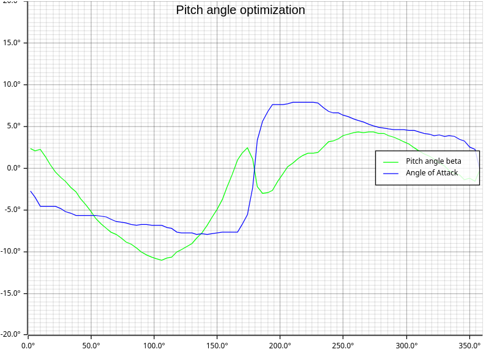
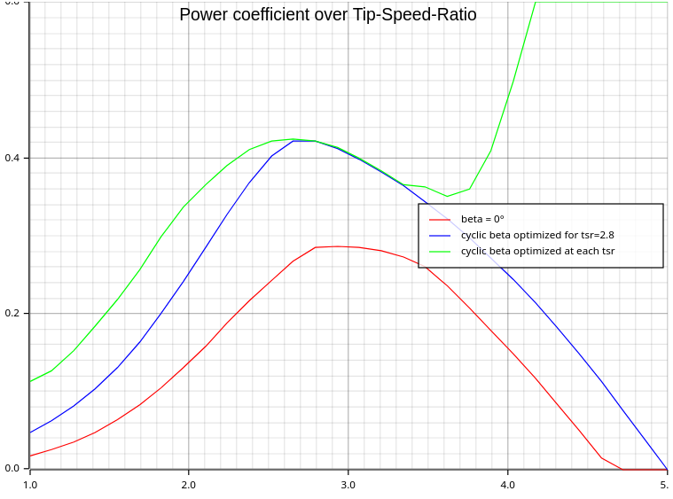

# Vertical Axis Wind Turbine Solver
This Crate provides a library for calculating performance figures of vertical axis windturbines.
It implements the Double-multiple streamtube model described by [I. Paraschivoiu (1981)](https://ntrs.nasa.gov/citations/19820015811)
and extends the model by allowing for variable pitch angles.

This allows for optimization of the pitch angle over the whole rotation of the turbine.
The below charts show an optimized pitch angle and the resulting increase of the Power coefficient.
 

# Examples
The [examples](examples) folder demonstrates the usage of this library with an interactiv jupyter notebook and the [evxr](https://github.com/evcxr/evcxr) kernel.
The above charts can be reproduced by the [Turbine](examples/Turbine.ipynb) example.

